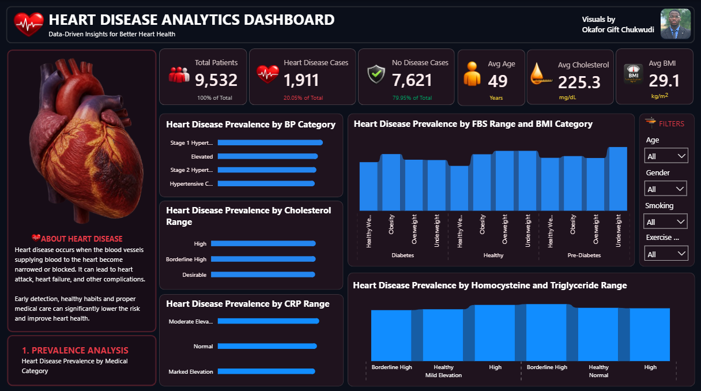
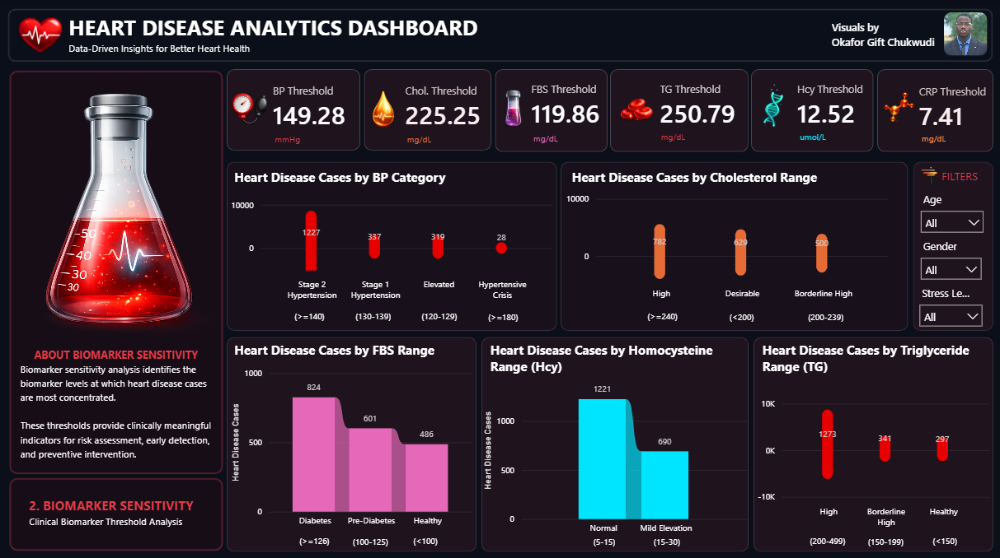
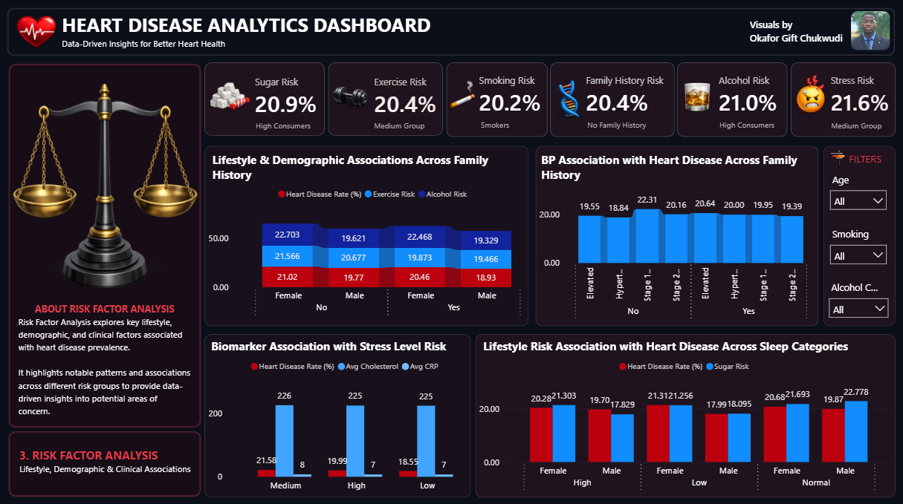
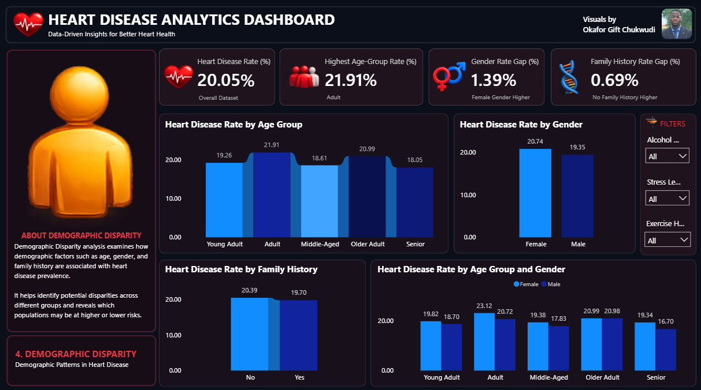
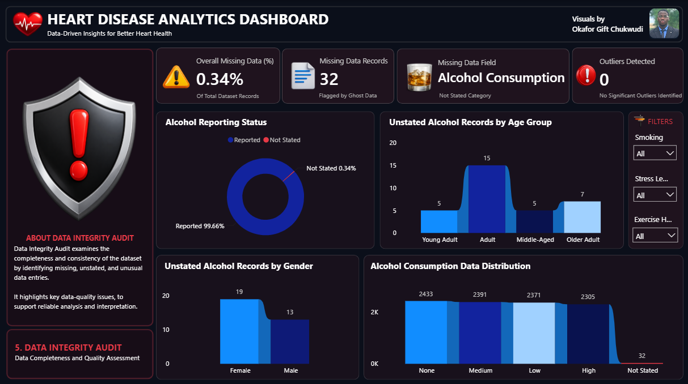

# 🫀Heart Disease Analytics Dashboard

An interactive Power BI dashboard designed to analyze heart disease patterns across clinical biomarkers, lifestyle and risk factors, demographic groups, and data-quality indicators.

## 📊 Project Overview

The Heart Disease Analytics Dashboard provides a multi-page analytical view of a heart disease dataset containing **9,532 patient records**.

The project transforms cleaned patient data into interactive visualizations and analytical insights using Power BI, DAX, and data preparation techniques.

The dashboard consists of five analytical pages, each focusing on a different aspect of the dataset.

## 📌 Dashboard Pages

### 1. Prevalence Analysis

Examines the distribution of heart disease across key clinical categories, including:

- Blood pressure
- Cholesterol
- Fasting blood sugar (FBS)
- BMI
- Homocysteine
- Triglycerides
- CRP

### 2. Biomarker Sensitivity

Explores the biomarker levels and threshold ranges associated with concentrations of heart disease cases.

Key biomarkers analyzed include:

- Blood pressure
- Cholesterol
- Fasting blood sugar
- Triglycerides
- Homocysteine
- CRP

### 3. Risk Factor Analysis

Investigates associations between heart disease and lifestyle or behavioral factors, including:

- Sugar consumption
- Exercise habits
- Smoking
- Alcohol consumption
- Stress level
- Sleep categories
- Family history

### 4. Demographic Disparity

Examines heart disease patterns across demographic groups, including:

- Age groups
- Gender
- Family history
- Age and gender combinations

### 5. Data Integrity Audit

Assesses the completeness and consistency of the dataset by identifying:

- Missing records
- Unstated alcohol information
- Missing-data distribution
- Potential numerical outliers

## 🔍 Key Insights

The dashboard highlights several notable patterns within the dataset, including differences in heart disease rates across clinical categories, lifestyle factors, demographic groups, and data-quality indicators.

The findings represent **observed associations within the dataset** and should not be interpreted as evidence of causal relationships.

## 🛠️ Tools & Technologies

- Power BI
- DAX
- Power Query
- Microsoft Excel
- Data Cleaning
- Exploratory Data Analysis
- Data Visualization

## 📷 Dashboard Preview

### Prevalence Analysis


### Biomarker Sensitivity


### Risk Factor Analysis


### Demographic Disparity


### Data Integrity Audit


## 📁 Repository Structure

```text
heart-disease-analytics-dashboard/
│
├── dashboard/
│   └── Heart_Disease_Analytics.pbix
│
├── screenshots/
│   ├── dashboard-1-prevalence-analysis.png
│   ├── dashboard-2-biomarker-sensitivity.png
│   ├── dashboard-3-risk-factor-analysis.png
│   ├── dashboard-4-demographic-disparity.png
│   └── dashboard-5-data-integrity-audit.png
│
├── documentation/
│   └── insights.md
│
└── data/
    └── README.md
